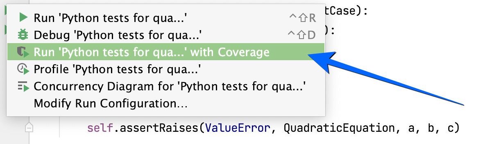

# Labolatoriun 4: _Pokrycie kodu testami_

---

## Pokrycie kodu testami

**Pokrycie kodu testami** (_ang. code coverage_) to metryka stosowana w testowaniu oprogramowania, która określa, jak wiele linii kodu źródłowego zostało wykrytych (skontrolowanych) przez testy automatyczne.

## Implementacja

- Umieść w pakiecie produkcyjnym implementację klasy;
- Umieść w pakiecie testowym implementację klasy
- Uruchom testy z raportem pokrycia kodu testami

## Analiza

- Kolor **czerwony** wskazuje linie, które nie zostały pokryte testami;
- Kolor **zielony** wskazuje linie, które zostały pokryte testami.

